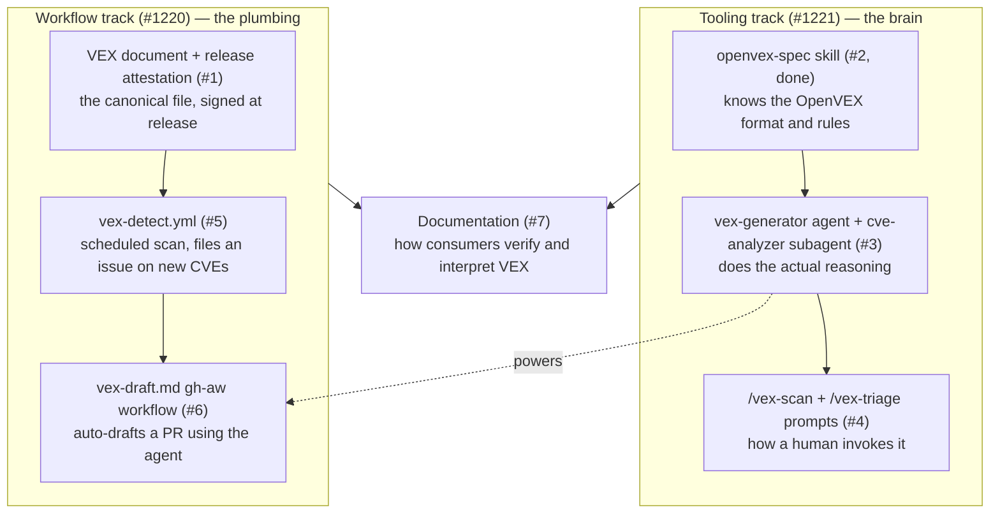

# VEX Implementation — How It Works

A high-level explanation of what the VEX capability does once all seven phases are implemented. For the phase-by-phase task breakdown, see [vex-workflow-and-agent-plan.instructions.md](vex-workflow-and-agent-plan.instructions.md). For checkable acceptance criteria, see [vex-validation-spec.md](vex-validation-spec.md).

## The problem it solves

A scanner (Trivy, OSV-Scanner, Grype) looks at your dependencies and reports "you have 50 CVEs." Most of those vulnerabilities are not actually exploitable in your code — the vulnerable function is never called, or an attacker cannot reach it. VEX (Vulnerability Exploitability eXchange) is a machine-readable document that records, per CVE: "we looked at this, and here is why it does or does not affect us." It turns scanner noise into accountable, signed answers.

## The two tracks

The work spans two complementary tracks that converge at Phase 6.

The two tracks converge at Phase 6: the detection plumbing (#5) notices a new CVE, and the AI brain (#3) drafts the answer.

## The end-to-end flow once everything is live

1. **Release happens.** The signed VEX document (#1) ships as a release artifact alongside the SBOM, attested via Sigstore so consumers can trust it.
2. **Detection runs on a schedule (or after a release).** `vex-detect.yml` (#5) re-scans dependencies, diffs findings against the current VEX document, and files a GitHub issue when a new CVE appears or a status drifts.
3. **The AI drafting workflow fires.** `vex-draft.md` (#6) invokes the `vex-generator` agent (#3), which:
   - runs a scan and enriches each CVE from OSV.dev and NVD,
   - hands each CVE to the `cve-analyzer` subagent to trace whether the vulnerable code is actually reachable,
   - classifies confidence into one of five bands, and
   - drafts an updated OpenVEX document as a pull request (maximum one).
4. **A human reviews and merges.** This is the core trust rule: AI drafts, human merges. The merge commit author becomes the accountable author of record. The agent is forbidden from asserting `not_affected` when confidence is low — uncertain cases default to `under_investigation`.
5. **The cycle repeats.** The next release re-attests the now-updated VEX document.

## The guardrails that make it safe

- **Evidence proportional to the claim.** Asserting `not_affected` requires a code citation proving unreachability; `under_investigation` requires nothing (the safe default).
- **Forbidden transitions.** The agent can never jump from "unknown reachability" to a confident verdict.
- **Confidence routing.** High-confidence findings get drafted with citations; Medium and Low findings get drafted as `under_investigation` with questions for the reviewer.
- **Licensing discipline.** It paraphrases only CC0 or public-domain advisory text and writes original prose for CC-BY-4.0 sources.
- **Sigstore as trust anchor.** The release workflow's identity signs the document, so downstream consumers can cryptographically verify it came from your pipeline.

## Why phase it this way

Each phase is independently shippable, and the dependency order matters. The brain (#2 to #3 to #4) and the foundation (#1) can be built in parallel, but the automated drafting (#6) needs both the agent and the detection workflow to exist first. Everything ships at `experimental` maturity until it is proven on three or more codebases with a 5% or lower false-positive rate on `not_affected`.

In one sentence: scanners find vulnerabilities, the AI agent reasons about whether they are actually exploitable in your code, a human approves the verdict, and the signed result ships with every release so your users can tell real risk from noise.
